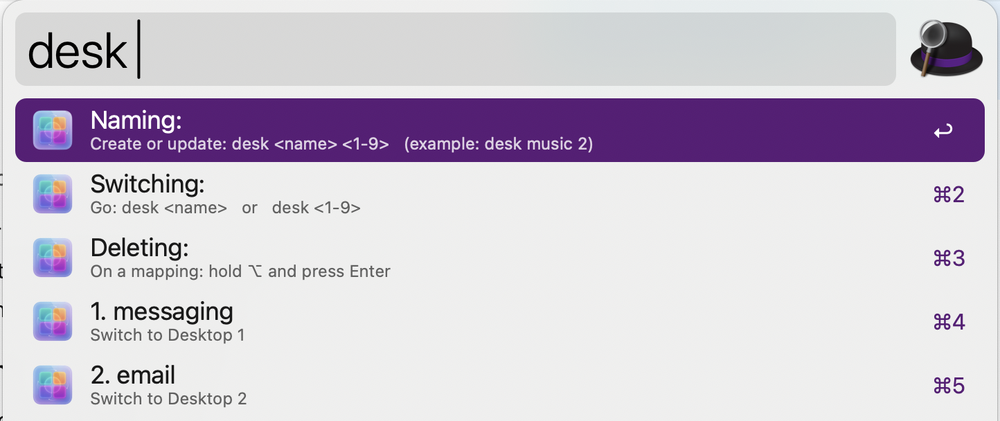

## Usage

Name and switch between macOS Desktop Spaces via the `desk` keyword.

* <kbd>↩</kbd> Switch to the selected Desktop (or save a new name → desktop mapping).
* <kbd>⌥</kbd><kbd>↩</kbd> Delete the selected mapping.

### Examples

* Name a desktop: `desk music 2` (also supports `desk music:2` or `desk music=2`)
* Switch by name: `desk music`
* Switch by number: `desk 2`

## Alternative Invocations

Alternatively, use the `d` keyword.

## Download

[Download the workflow from GitHub Releases](https://github.com/barelyknown/desk-alfred-workflow/releases)

## Setup

### Requirements

* **Python 3** must be available (`python3`). If Alfred shows “Python 3 not found”, install Python 3 and try again.
* **Mission Control shortcuts** must be enabled for switching:

  * System Settings → Keyboard → Keyboard Shortcuts… → Mission Control → enable “Switch to Desktop 1” … “Switch to Desktop 9”.

### Permissions

On first use, macOS may ask for permission to control **System Events**. If switching fails:

* System Settings → Privacy & Security → **Accessibility** → enable Alfred
* System Settings → Privacy & Security → **Automation** → allow Alfred to control System Events

## Data & Privacy

Mappings are stored locally on your Mac as a JSON file in Alfred’s workflow data directory.

## Limitations

* Desktop switching supports **Desktop 1–9** (macOS Control–1..9 shortcuts).
